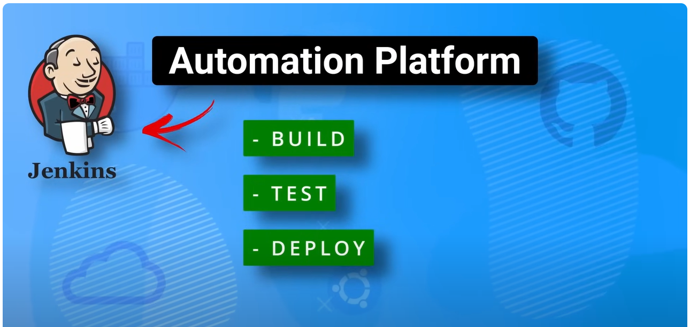

# CI/CD with Jenkins

## Jenkins

Jenkins is an automation platfrom that allows you to build, test and deploy softwares using pipeline.
It is basically just a way to automate the work that developers do not want to do. So they can save their time
and dome more productive things.

<p align="center">
    
</p>

But, it is not just limited to creating pipelines for code. It can be used to automate any tasks.
Jenkins provides a web UI where you can create jobs and customize all the functionality that you want
such as source control management, pre and post build actions as well as build triggers. This allows you
to run tasks on demand by clicking a button or have them triggered automatically via web hooks.

## Jenkins Features

- `Continuous Integration and Continuous Delivery`: As an extensible automation server, Jenkins can be used as a simple CI server or turned into the continuous delivery hub for any project.
- `Easy installation`: Jenkins is a self-contained Java-based program, ready to run out-of-the-box, with packages for Windows, Linux, macOS and other Unix-like operating systems.
- `Easy configuration`: Jenkins can be easily set up and configured via its web interface, which includes on-the-fly error checks and built-in help.
- `Plugins`: With hundreds of plugins in the Update Center, Jenkins integrates with practically every tool in the continuous integration and continuous delivery toolchain
- `Extensible`: Jenkins can be extended via its plugin architecture, providing nearly infinite possibilities for what Jenkins can do.
- `Distributed`: Jenkins can easily distribute work across multiple machines, helping drive builds, tests and deployments across multiple platforms faster

## Jenkins Infrastructure

First, you have the master server which controls the pipelines and schedules builds to agents.
Then, you have the agents which run the build in their workspace.

<p align="center">
    
</p>

An example workflow may look like this:

1. A developer commits some code to a repository,
2. The jenkins master becomes aware of this commit and triggers the appropriate pipeline,
3. And distributes the build to one of agents to run,
4. It selects the appropriate agent based on labels which issomething that you can configure through the jenkins ui,
5. The agent runs the build which is usually just a bunch of linux commands to build, test and distribute your code.

## Jenkins Agent Types
#### There are 2 main categories of jenkins agents.
- #### Permanent Agents: You can think of these just as standalone linux or windows servers that are configured to run jenkins jobs. These are just basic everyday servers. The only real setup of them is you need to have java installed and you need to make sure that the ssh is set up. You will also want to make sure that you have any type of build tools that you want to use on these servers installed as the agents are going to be the workhorses that run your actual builds.
- #### Cloud Agents: They are a much more popular choice in real world environments. Some examples of cloud agents are Docker, Kubernetes adn AWS Fleet manager. In these scenarios, jenkins can dynamically spin up agents based on the agent templates that you configure.                                                     

## Build Types

<p align="center">
    
</p>

<p align="center">
    
</p>

Pipelines are commonly broken into different stages.
As you can see, this pipeline is broken into five
different stages. These stages can differ depending
on the project.

- The clone stage is usually made of pulling down the code
  from a git repository and setting up the local environment
  on the agent.
- The build stage takes the code and builds it which means
  generating some type of local artifact like a jar file or
  executable.
- The test stage runs tests against newly built code.
- The package stage packages up it so it is ready for deployment.
- In the deploy stage, the artifact is sent to registry.

## Installation with Docker

### Build the Jenkins BlueOcean Docker Image (or pull and use the one I built)

```
docker build -t myjenkins-blueocean:2.414.2 .

#IF you are having problems building the image yourself, you can pull from my registry (It is version 2.332.3-1 though, the original from the video)

docker pull devopsjourney1/jenkins-blueocean:2.332.3-1 && docker tag devopsjourney1/jenkins-blueocean:2.332.3-1 myjenkins-blueocean:2.332.3-1
```

### Create the network 'jenkins'

```
docker network create jenkins
```

### Run the Container

#### MacOS / Linux

```
docker run --name jenkins-blueocean --restart=on-failure --detach \
  --network jenkins --env DOCKER_HOST=tcp://docker:2376 \
  --env DOCKER_CERT_PATH=/certs/client --env DOCKER_TLS_VERIFY=1 \
  --publish 8080:8080 --publish 50000:50000 \
  --volume jenkins-data:/var/jenkins_home \
  --volume jenkins-docker-certs:/certs/client:ro \
  myjenkins-blueocean:2.414.2
```

#### Windows

```
docker run --name jenkins-blueocean --restart=on-failure --detach `
  --network jenkins --env DOCKER_HOST=tcp://docker:2376 `
  --env DOCKER_CERT_PATH=/certs/client --env DOCKER_TLS_VERIFY=1 `
  --volume jenkins-data:/var/jenkins_home `
  --volume jenkins-docker-certs:/certs/client:ro `
  --publish 8080:8080 --publish 50000:50000 myjenkins-blueocean:2.414.2
```

### Get the Password

```
docker exec jenkins-blueocean cat /var/jenkins_home/secrets/initialAdminPassword
```

### Connect to the Jenkins

```
https://localhost:8080/
```


## Jenkins Filesystem and Workspace

```
docker exec jenkins-blueocean bash
```

Then,

```
cd /var/jenkins_home
```

Then,

```
cd workspace
```

When you look at the directory with ls, you will see your project folder. And inside it, you will see
the files that are used in build.


## Setting up Docker Cloud Agents

1) Go to "Manage Jenkins" tab on the Dashboard
2) Select "Manage Nodes and Cloud"
3) Then, select "Configure Clouds"
4) Then, install the "Docker" plugin
5) Then, select the restart after installation checkbox

After restarting the Jenkins,

1) Go to "Manage Jenkins" tab on the Dashboard
2) Select "Manage Nodes and Cloud"
3) Then, select Configure Clouds
4) Then, "Add a new cloud", select Docker
5) Then add Docker Cloud details, there is a couple of things that you need to do
   - Docker Host URI: If you want to run docker within the jenkins, you could just use like 127.0.0.1. But, I want to run docker in my local machine. I do not want to run Docker with Jenkins.
   To help proxy the connection from our Jenkins master container over to our localhost, 
    ```
    docker run -d --restart=always -p 127.0.0.1:2376:2375 --network jenkins -v /var/run/docker.sock:/var/run/docker.sock alpine/socat tcp-listen:2375,fork,reuseaddr unix-connect:/var/run/docker.sock
    ```
      Then, inspect the ip address socket container. It should be something like "127.23.0.3"
    ```
    docker inspect <container_name>
    ```
    I want to forward my connections for docker to this ip address.
    
    You need to input the following into Docker Host URI:
    ```
    tcp://172.23.0.3:2375
    ```

6) Then, apply and save it.
7) Then, go to the cloud section again, and add Docker Agent template with the following settings:


<p align="center">
    
</p>


## CI/CD with Declarative Pipeline 

Declarative Pipeline presents a more simplified and opinionated syntax on top of the Pipeline sub-systems.


<p align="center">
    
</p>


#### We write everything inside pipeline tag. We specified on which agent the pipeline will be executed. Remember we have created agent labeled as docker-agent-alpine. We can specify it in here.
#### Then, we have a Stages -> Stage -> Steps.

## CI/CD using Jenkinsfile

<p align="center">
    
</p>


